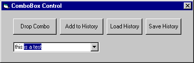



## ComboBox Auto\-Complete

### Description

Auto-Completes your Dropdown Combo Style ComboBoxes. Inspired by Dave Havard and Dan Redding's posts, I decided to write one of my own. It doesn't need the Keyboard Hook like Dave's and handles backspaces better than Dan's. Function is in a module and ready to be included in your project. Just call it on the Combo_Change event.  ** Re-submitted 4/5/00 **  Minor Updates including ComboWidth updating (Thanks to Randy Birch's posts). I had to resubmit because khanjar@videotron.ca made an unwarrented vote of "poor". People were avoiding this post like the plague...for no good reason. Khanjar, you suck.  ** Re-submitted 4/11/00 **  Includes a much better method for determining maximum text width. Thanks to Jeff Cockayne's contribution, additional features like Adding to History, Load & Save History plus allows use of upper & lower case typing. Thanks again Jeff!   Please Vote! 
 
### More Info
 

             |
---                |---
**Submitted On**   |2000-04-11 14:42:00
**By**             |[Paul Mather](https://github.com/Planet-Source-Code/PSCIndex/blob/master/ByAuthor/paul-mather.md)
**Level**          |Intermediate
**User Rating**    |4.7 (89 globes from 19 users)
**Compatibility**  |VB 5\.0, VB 6\.0
**Category**       |[Windows API Call/ Explanation](https://github.com/Planet-Source-Code/PSCIndex/blob/master/ByCategory/windows-api-call-explanation__1-39.md)
**World**          |[Visual Basic](https://github.com/Planet-Source-Code/PSCIndex/blob/master/ByWorld/visual-basic.md)
**Archive File**   |[CODE\_UPLOAD46954112000\.zip](https://github.com/Planet-Source-Code/paul-mather-combobox-auto-complete__1-7037/archive/master.zip)

